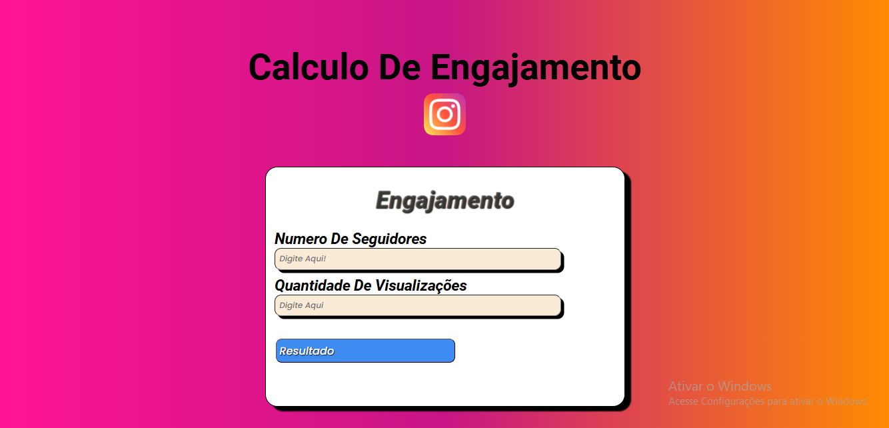

# 🖥️ Projeto-calculadora

## Calculadora de engajamento para instagram

### convertendo de forma rapida e facil o resultado que voçe alcança na rede social mais usada no mundo!

## 🔎 Tecnologias

Esse projeto foi desenvolvido com as seguintes tecnologias:

- 🟠HTML 
 
- 🔷CSS

- 🟨JAVASCRIPT

- 🔻GITHUB

## 🎨 Layout

Você pode visualizar o layout do projeto abaixo!

### 🧑‍💻 Creditos

PROFESSOR: [Luan Oliveira](https://www.linkedin.com/in/luanpdd/)

